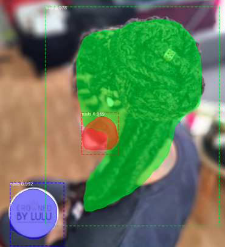

# Mask R-CNN for Object Detection and Segmentation

This is a forked repository of MaskRCNN customized to work on the custom dataset.
The custom dataset consist of two classes nails and hair. 


## Content:

## 1. Objective
  Here the objective wast to segment the hairs and nails in an image. The segmented regions are further used to get the length of the hairs and color 
  of both nails and hair. The dataset is colected from Instagram and Pintrest.

## 2. Dataset Annotation
  In order to perform instance segmentation on our dataset, we require images and an annotation file which contains ROI from all the images in the form of 
  coordinates. To do this, [VGG annotation tool](https://www.robots.ox.ac.uk/~vgg/software/via/) is used. This tool is a web based annotation tool. It is very easy to create the label and fast to annotate. 

  Tip: While annotating some of the cordinates may fall at the boundary of the image, which can create error while creating an overlay mask. In that case the boundary cordinate value is just subtracted by 1 to make it work. So. visualize your dataset and check if any entry is invalid.

## 3. Datset Visualization 
  After annotating the dataset use the [inspect_hair_nails_data.ipynb](samples/beauty/inspect_hair_nails_data.ipynb) from the repo to visualize and confirm whether all the images in the dataset are properly annotated and mapping of the labels with their corresponding image is valid.

   
  


## 4. Model training on Custom dataset  
  To train MASK-RCNN on create a folder inside samples directory with name based on your images and copy "beauty.py", "inspect_hair_nails_data.ipynb", "inspect_hair_nails_model.ipynb" into your folder. Next do the following changes:

   1. Datset related configuration
      Check the class [BeautyConfig]((samples/beauty/beauty.py). 
      This is need to configure the number of class, GPU's and epochs. Total classes will be N+1 (Classes + Background)
    
   2. Convert labels to numerals.
      Modify the class [BeautyDataset]((samples/beauty/beauty.py) to read the labels from the annotation file and convert them into numerals.
      Since I have two classes so it looks that way.
  
  Once these modification are done you are good to go for training.
  Training MASK-RCNN with ResNet50/100 as backbone requires atleast 12GB of GPU. I trained it on a P2 instance in AWS EC2. 

5. Model Evaluation Results.
  TRUE POSITIVES:
  
  
  

  FALSE POSITIVES:

  


# Detailed explanation on how to run in on ur own dataset.


* [demo.ipynb](samples/demo.ipynb) Is the easiest way to start. It shows an example of using a model pre-trained on MS COCO to segment objects in your own images.
It includes code to run object detection and instance segmentation on arbitrary images.

* [train_shapes.ipynb](samples/shapes/train_shapes.ipynb) shows how to train Mask R-CNN on your own dataset. This notebook introduces a toy dataset (Shapes) to demonstrate training on a new dataset.

* ([model.py](mrcnn/model.py), [utils.py](mrcnn/utils.py), [config.py](mrcnn/config.py)): These files contain the main Mask RCNN implementation. 


* [inspect_hair_nails_data.ipynb](samples/beauty/inspect_hair_nails_data.ipynb). This notebook visualizes the different pre-processing steps
to prepare the training data.

* [inspect_hair_nails_model.ipynb](ssamples/beauty/inspect_hair_nails_model.ipynb) This notebook goes in depth into the steps performed to detect and segment objects. It provides visualizations of every step of the pipeline.

* [inspect_weights.ipynb](samples/coco/inspect_weights.ipynb)
This notebooks inspects the weights of a trained model and looks for anomalies and odd patterns.


# Step by Step Detection
To help with debugging and understanding the model, there are 3 notebooks 
([inspect_data.ipynb](samples/coco/inspect_data.ipynb), [inspect_model.ipynb](samples/coco/inspect_model.ipynb),
[inspect_weights.ipynb](samples/coco/inspect_weights.ipynb)) that provide a lot of visualizations and allow running the model step by step to inspect the output at each point. Here are a few examples:


## 1. Anchor sorting and filtering
Visualizes every step of the first stage Region Proposal Network and displays positive and negative anchors along with anchor box refinement.


## 2. Bounding Box Refinement
This is an example of final detection boxes (dotted lines) and the refinement applied to them (solid lines) in the second stage.


## 3. Mask Generation
Examples of generated masks. These then get scaled and placed on the image in the right location.


## 4.Layer activations
Often it's useful to inspect the activations at different layers to look for signs of trouble (all zeros or random noise).


## 5. Weight Histograms
Another useful debugging tool is to inspect the weight histograms. These are included in the inspect_weights.ipynb notebook.


## 6. Logging to TensorBoard
TensorBoard is another great debugging and visualization tool. The model is configured to log losses and save weights at the end of every epoch.


## 6. Composing the different pieces into a final result


# Training on MS COCO
We're providing pre-trained weights for MS COCO to make it easier to start. You can
use those weights as a starting point to train your own variation on the network.
Training and evaluation code is in `samples/coco/coco.py`. You can import this
module in Jupyter notebook (see the provided notebooks for examples) or you
can run it directly from the command line as such:

```
# Train a new model starting from pre-trained COCO weights
python3 samples/coco/coco.py train --dataset=/path/to/coco/ --weights=coco

# Train a new model starting from ImageNet weights
python3 samples/coco/coco.py train --dataset=/path/to/coco/ --weights=imagenet

# Continue training a model that you had trained earlier
python3 samples/coco/coco.py train --dataset=/path/to/coco/ --weights=/path/to/weights.h5

# Continue training the last model you trained. This will find
# the last trained weights in the model directory.
python3 samples/coco/coco.py train --dataset=/path/to/coco/ --weights=last
```

You can also run the COCO evaluation code with:
```
# Run COCO evaluation on the last trained model
python3 samples/coco/coco.py evaluate --dataset=/path/to/coco/ --weights=last
```

The training schedule, learning rate, and other parameters should be set in `samples/coco/coco.py`.


# Training on Your Own Dataset

Start by reading this [blog post about the balloon color splash sample](https://engineering.matterport.com/splash-of-color-instance-segmentation-with-mask-r-cnn-and-tensorflow-7c761e238b46). It covers the process starting from annotating images to training to using the results in a sample application.

In summary, to train the model on your own dataset you'll need to extend two classes:

```Config```
This class contains the default configuration. Subclass it and modify the attributes you need to change.

```Dataset```
This class provides a consistent way to work with any dataset. 
It allows you to use new datasets for training without having to change 
the code of the model. It also supports loading multiple datasets at the
same time, which is useful if the objects you want to detect are not 
all available in one dataset. 


## Citation
Use this bibtex to cite this repository:
```
@misc{matterport_maskrcnn_2017,
  title={Mask R-CNN for object detection and instance segmentation on Keras and TensorFlow},
  author={Waleed Abdulla},
  year={2017},
  publisher={Github},
  journal={GitHub repository},
  howpublished={\url{https://github.com/matterport/Mask_RCNN}},
}
```

## Contributing
Contributions to this repository are welcome. Examples of things you can contribute:
* Speed Improvements. Like re-writing some Python code in TensorFlow or Cython.
* Training on other datasets.
* Accuracy Improvements.
* Visualizations and examples.

You can also [join our team](https://matterport.com/careers/) and help us build even more projects like this one.

## Requirements
Python 3.4, TensorFlow 2.*, Keras 2.*, and other common packages listed in `requirements.txt`.

### MS COCO Requirements:
To train or test on MS COCO, you'll also need:
* pycocotools (installation instructions below)
* [MS COCO Dataset](http://cocodataset.org/#home)
* Download the 5K [minival](https://dl.dropboxusercontent.com/s/o43o90bna78omob/instances_minival2014.json.zip?dl=0)
  and the 35K [validation-minus-minival](https://dl.dropboxusercontent.com/s/s3tw5zcg7395368/instances_valminusminival2014.json.zip?dl=0)
  subsets. More details in the original [Faster R-CNN implementation](https://github.com/rbgirshick/py-faster-rcnn/blob/master/data/README.md).


## Installation
1. Clone this repository
2. Install dependencies
   ```bash
   pip3 install -r requirements.txt
   ```
3. Run setup from the repository root directory
    ```bash
    python3 setup.py install
    ``` 
3. Download pre-trained COCO weights (mask_rcnn_coco.h5) from the [releases page](https://github.com/matterport/Mask_RCNN/releases).
4. (Optional) To train or test on MS COCO install `pycocotools` from one of these repos. They are forks of the original pycocotools with fixes for Python3 and Windows (the official repo doesn't seem to be active anymore).

    * Linux: https://github.com/waleedka/coco
    * Windows: https://github.com/philferriere/cocoapi.
    You must have the Visual C++ 2015 build tools on your path (see the repo for additional details)

# Projects Using this Model
If you extend this model to other datasets or build projects that use it, we'd love to hear from you.

### [4K Video Demo](https://www.youtube.com/watch?v=OOT3UIXZztE) by Karol Majek.
[](https://www.youtube.com/watch?v=OOT3UIXZztE)

### [Images to OSM](https://github.com/jremillard/images-to-osm): Improve OpenStreetMap by adding baseball, soccer, tennis, football, and basketball fields.


### [Splash of Color](https://engineering.matterport.com/splash-of-color-instance-segmentation-with-mask-r-cnn-and-tensorflow-7c761e238b46). A blog post explaining how to train this model from scratch and use it to implement a color splash effect.


### [Segmenting Nuclei in Microscopy Images](samples/nucleus). Built for the [2018 Data Science Bowl](https://www.kaggle.com/c/data-science-bowl-2018)
Code is in the `samples/nucleus` directory.


